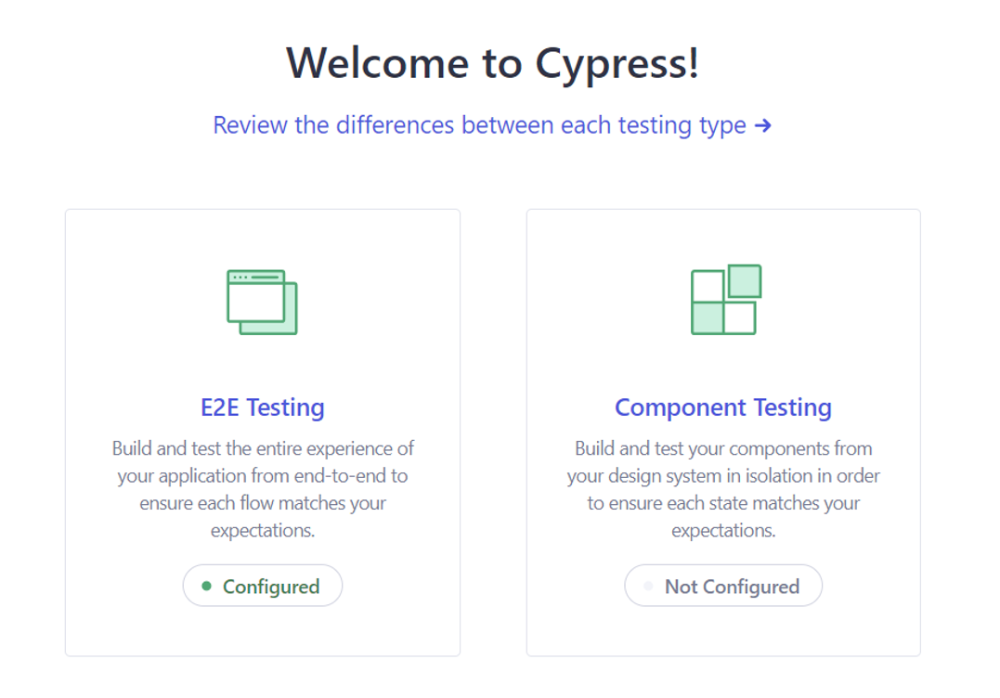

# Proyecto de Formulario de Registro con Cypress

Este proyecto implementa un formulario de registro web con validaciones y pruebas automatizadas utilizando Cypress. El formulario incluye campos para nombre completo, correo electrónico, contraseña, confirmación de contraseña, fecha de nacimiento y aceptación de términos y condiciones.

## Requisitos del Sistema

- Node.js (versión recomendada: 14.x o superior)
- npm (normalmente viene con Node.js)

## Instalación

1. Clona este repositorio:
git clone https://github.com/eliasp4/proyecto-cypress-testing/tree/main

2. Navega al directorio del proyecto:
cd proyecto-cypress-testing

3. Inicializa el proyecto con npm:
npm init -y

4. Instala las dependencias:
npm install cypress --save-dev

## Configuración

Asegúrate de que tu `package.json` incluya los siguientes scripts:

json
"scripts": {
"cy:open": "cypress open",
"cy:run": "cypress run",
"dev": "webpack serve --mode development"
}

## Estructura del Proyecto

- `public/index.html`: Formulario de registro HTML
- `public/confirmacion.html`: Confirmacion de registro HTML
- `public/js/funcionalidades_form.js`: Lógica de validación del formulario
- `public/js/funcionalidades_cn.js`: Lógica de validación de confirmacion
- `public/css/styles.css`: Estilos del formulario
- `public/css/styles_cn.css`: Estilos de confirmacion
- `cypress/e2e/test_formulario.cy.js`: Pruebas de Cypress

## Ejecución

1. Para iniciar el servidor de desarrollo:

`npm run dev`

2. Para abrir Cypress y ejecutar las pruebas:

`npm run cy:open`

Este comando abrirá la interfaz de Cypress, permitiéndote ejecutar y depurar tus pruebas de manera visual.

**A. Abrir la interfaz de Cypress:**

Ejecuta el comando `npm run cy:open` en tu terminal. Esto abrirá la ventana de Cypress.

**B. Elegir el tipo de pruebas:**

En la interfaz de Cypress, elige "E2E Testing" para pruebas de extremo a extremo. Luego, selecciona el navegador que deseas utilizar para ejecutar las pruebas, por ejemplo, Edge.

**C. Seleccionar el archivo de pruebas:**

Dentro de la sección "Specs", verás una lista de todos los archivos de prueba disponibles en tu proyecto. Selecciona el archivo `test_formulario.cy.js` para ejecutar las pruebas de validación del formulario.

**D. Ejecutar las pruebas:**

Una vez que hayas seleccionado el archivo `test_formulario.cy.js`, Cypress comenzará a ejecutar las pruebas automáticamente, mostrando el estado de cada validación en tiempo real.

3. Para ejecutar las pruebas en modo headless:
(Yo las hago desde la interfaz, por lo que me quedo en el punto 2)

`npm run cy:run`

## Implementación de Validaciones

- Las validaciones se realizan en el lado del cliente utilizando JavaScript.
- Se implementó un evento 'blur' en el campo de correo electrónico para validar su formato.
- Los mensajes de error se muestran dinámicamente junto a cada campo.

## Casos de Prueba Implementados

1. Validación de campos obligatorios
2. Formato de correo electrónico
3. Requisitos de contraseña (longitud y complejidad)
4. Coincidencia de contraseñas
5. Aceptación de términos y condiciones
6. Flujo completo de registro exitoso

## Página de Confirmación

Después de un registro exitoso, el usuario es redirigido a una página de confirmación que muestra:

- Un mensaje de bienvenida personalizado
- Un resumen de la información registrada (excluyendo la contraseña)
- Un botón para regresar al inicio

## Desafíos y Soluciones

1. **Validación de correo electrónico**: Se implementó un evento 'blur' para asegurar la validación correcta.
2. **Manejo de alertas en Cypress**: Se utilizaron stubs para simular y verificar las alertas del navegador.

## Capturas de Pantalla

[Incluye aquí las capturas de pantalla de los tests pasando en Cypress, ubicadas en `cypress/screenshots`.]

## Ejecución de Pruebas Individuales

Para ejecutar una prueba específica:

Como lo hago yo para ejecutar pru

npx cypress run --spec "cypress/e2e/test_formulario.cy.js"
