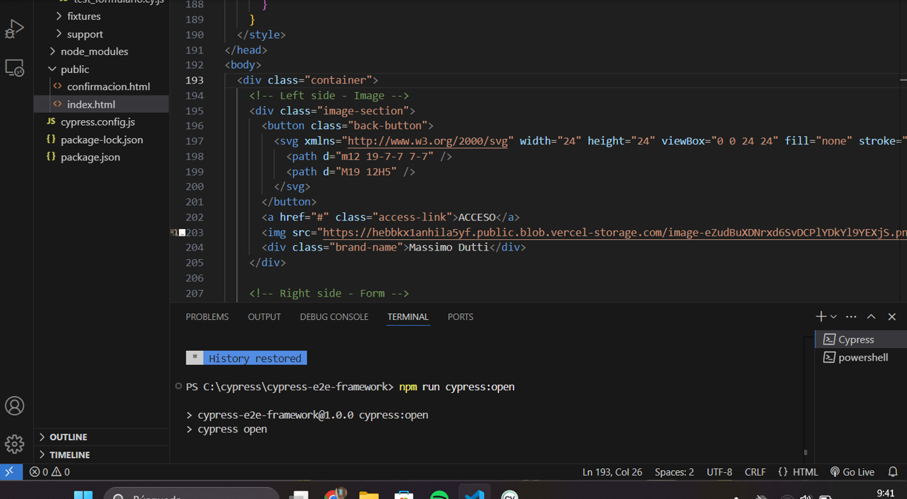
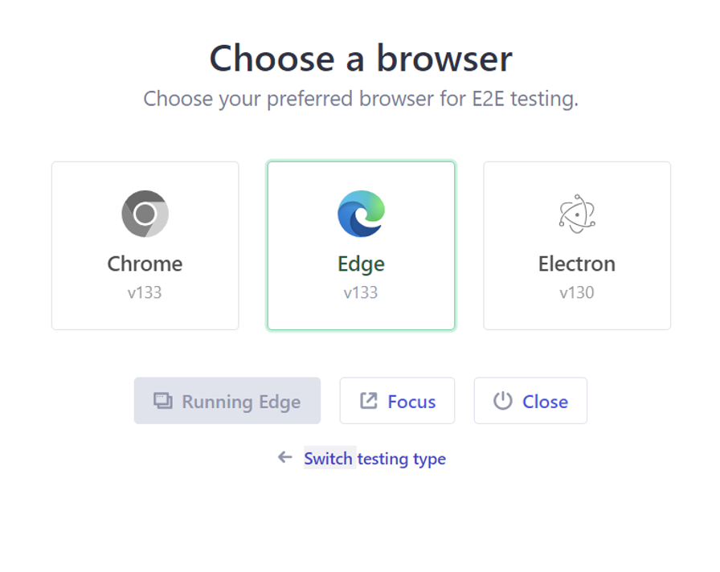
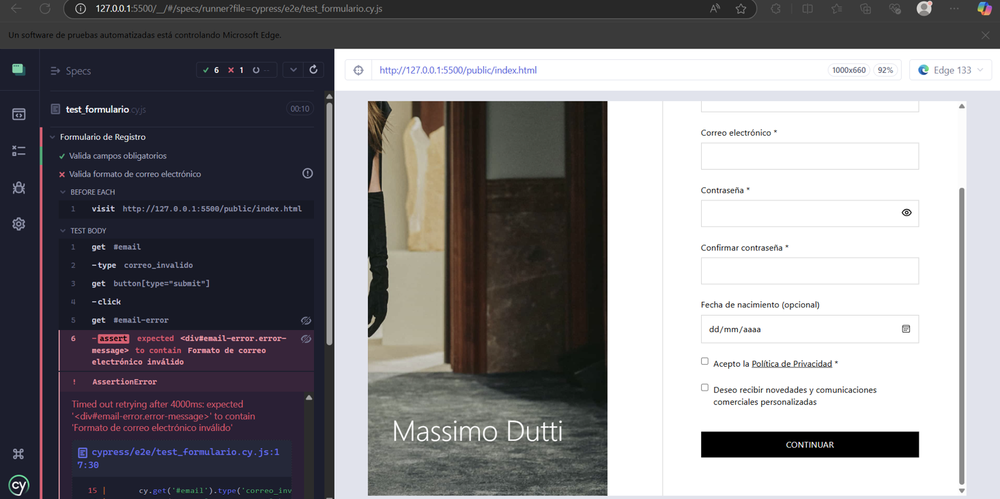
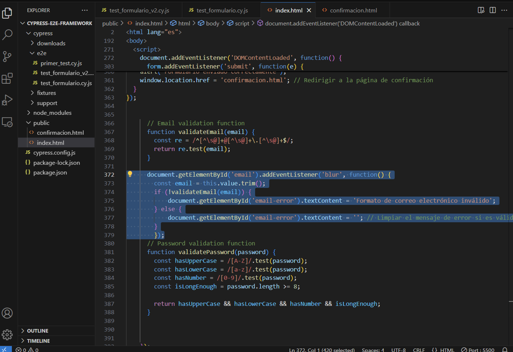
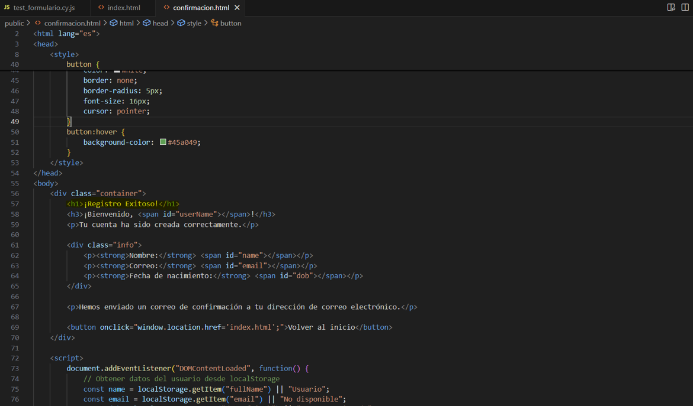
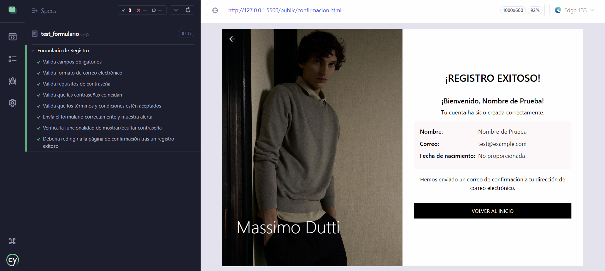
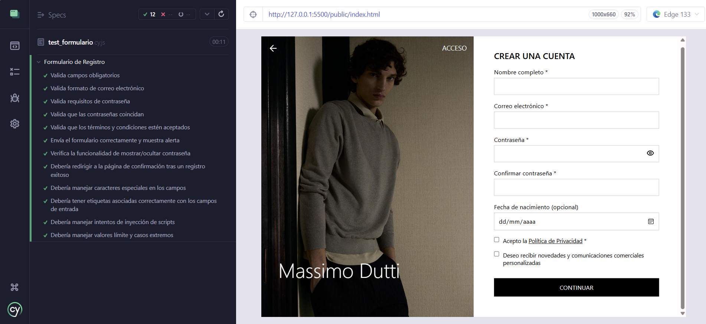

# Proyecto de Formulario de Registro con Cypress

Este proyecto implementa un formulario de registro web con validaciones y pruebas automatizadas utilizando Cypress. El formulario incluye campos para nombre completo, correo electrónico, contraseña, confirmación de contraseña, fecha de nacimiento y aceptación de términos y condiciones.

## Requisitos del Sistema

- Node.js (versión recomendada: 14.x o superior)
- npm (normalmente viene con Node.js)

## Instalación
1. Clona este repositorio:  
   ```bash
   git clone https://github.com/eliasp4/proyecto-cypress-testing.git
   ```
2. Navega al directorio del proyecto:  
   ```bash
   cd proyecto-cypress-testing
   ```
3. Inicializa el proyecto con npm:  
   ```bash
   npm init -y
   ```
4. Instala las dependencias:  
   ```bash
   npm install cypress --save-dev
   ```

## Configuración

Asegúrate de que tu `package.json` incluya los siguientes scripts:

```json
"scripts": {
  "cy:open": "cypress open",
  "cy:run": "cypress run",
  "dev": "webpack serve --mode development"
}
```

## Estructura del Proyecto

- `public/index.html`: Formulario de registro HTML
- `public/confirmacion.html`: Confirmacion de registro HTML
- `public/js/funcionalidades_form.js`: Lógica de validación del formulario
- `public/js/funcionalidades_cn.js`: Lógica de validación de confirmacion
- `public/css/styles.css`: Estilos del formulario
- `public/css/styles_cn.css`: Estilos de confirmacion
- `cypress/e2e/test_formulario.cy.js`: Pruebas de Cypress

## Ejecución

1. Para iniciar el servidor de desarrollo:
```bash
npm run dev
```

2. Para abrir Cypress y ejecutar las pruebas:
 ```bash
npm run cy:open
```

Este comando abrirá la interfaz de Cypress, permitiéndote ejecutar y depurar tus pruebas de manera visual.

**A. Abrir la interfaz de Cypress:**

Ejecuta el comando `npm run cy:open` en tu terminal. Esto abrirá la ventana de Cypress.



**B. Elegir el tipo de pruebas:**

En la interfaz de Cypress, elige "E2E Testing" para pruebas de extremo a extremo. Luego, selecciona el navegador que deseas utilizar para ejecutar las pruebas, por ejemplo, Edge.




**C. Seleccionar el archivo de pruebas:**

Dentro de la sección "Specs", verás una lista de todos los archivos de prueba disponibles en tu proyecto. Selecciona el archivo `test_formulario.cy.js` para ejecutar las pruebas de validación del formulario.


**D. Ejecutar las pruebas:**

Una vez que hayas seleccionado el archivo `test_formulario.cy.js`, Cypress comenzará a ejecutar las pruebas automáticamente, mostrando el estado de cada validación en tiempo real.


3. Para ejecutar las pruebas en modo headless:
(Yo las hago desde la interfaz, por lo que me quedo en el punto 2)
 ```bash
npm run cy:run
```

## Implementación de Validaciones

- Las validaciones se realizan en el lado del cliente utilizando JavaScript.
- Se implementó un evento 'blur' en el campo de correo electrónico para validar su formato.
- Los mensajes de error se muestran dinámicamente junto a cada campo.


## Casos de Prueba Implementados

1. Validación de campos obligatorios
2. Formato de correo electrónico
3. Requisitos de contraseña (longitud y complejidad)
4. Coincidencia de contraseñas
5. Aceptación de términos y condiciones
6. Flujo completo de registro exitoso


## Página de Confirmación

Después de un registro exitoso, el usuario es redirigido a una página de confirmación que muestra:

- Un mensaje de bienvenida personalizado
- Un resumen de la información registrada (excluyendo la contraseña)
- Un botón para regresar al inicio


## Desafíos y Soluciones

### 1. Validación de correo electrónico
**Problema:** Al probar la validación del correo, Cypress detectaba un error en el formato.  


**Solución:** Se implementó un evento \`'blur'\` en el campo de correo electrónico dentro del JavaScript del formulario, asegurando que la validación se dispare correctamente cuando el usuario salga del campo.  



### 2. Manejo de alertas en Cypress
**Problema:** Cypress no detectaba correctamente las alertas del navegador.

**Solución:** Se utilizaron *stubs* para simular y verificar las alertas, permitiendo validar su activación sin necesidad de interacción manual.

### 3. Redirección a la página de confirmación
**Problema:** La prueba que validaba la redirección tras un registro exitoso fallaba porque Cypress no encontraba el texto `¡REGISTRO EXITOSO!` en la página de confirmación.  


**Solución:** Se modificó el archivo `confirmacion.html`, agregando un `<h1>` con el texto `¡REGISTRO EXITOSO!`. Esto permitió que la validación se ejecutara correctamente. (Ademas le añadi un css similar al de la pagina de inscripcion)  



### 4. Validación de longitud del nombre
**Problema:** La prueba de "Debería manejar valores límite y casos extremos" fallaba porque no había una validación para nombres demasiado largos.


**Solución:** Se implementó una función `validateName` para verificar la longitud del nombre y se añadió la validación correspondiente en el evento 'blur' del campo de nombre y en la validación del formulario.



### 5. Manejo de inyección de scripts
**Problema:** La prueba de "Debería manejar intentos de inyección de scripts" fallaba porque el contenido del script se mostraba sin escapar en la página de confirmación.

**Solución:** Se implementó una función de sanitización para escapar los caracteres especiales en el nombre antes de mostrarlo en la página de confirmación, previniendo así la ejecución de scripts maliciosos.

---

## Capturas de Pantalla

https://github.com/eliasp4/proyecto-cypress-testing/tree/main/cypress/screenshost

## Ejecución de Pruebas Individuales

Para ejecutar una prueba específica:

npx cypress run --spec "cypress/e2e/test_formulario.cy.js"

## Lecciones Aprendidas

1. La importancia de implementar validaciones tanto en tiempo real (eventos 'blur') como en el envío del formulario.
2. La necesidad de manejar casos extremos, como nombres muy largos o intentos de inyección de scripts.
3. La utilidad de Cypress para simular interacciones del usuario y verificar el comportamiento del formulario en diferentes escenarios.
4. La importancia de la sanitización de datos para prevenir vulnerabilidades de seguridad.

## Mejoras Futuras

1. Implementar validaciones del lado del servidor para mayor seguridad.
2. Añadir más pruebas para cubrir casos de uso adicionales.
3. Mejorar la accesibilidad del formulario para usuarios con discapacidades.
4. Implementar internacionalización para soportar múltiples idiomas.

